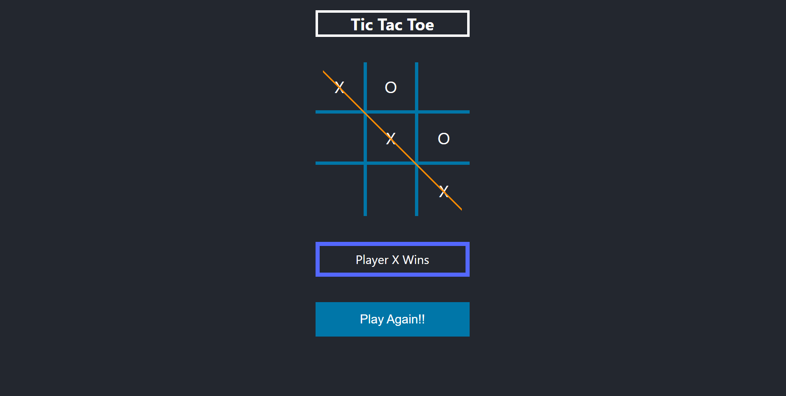
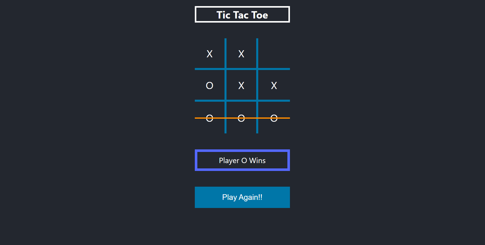
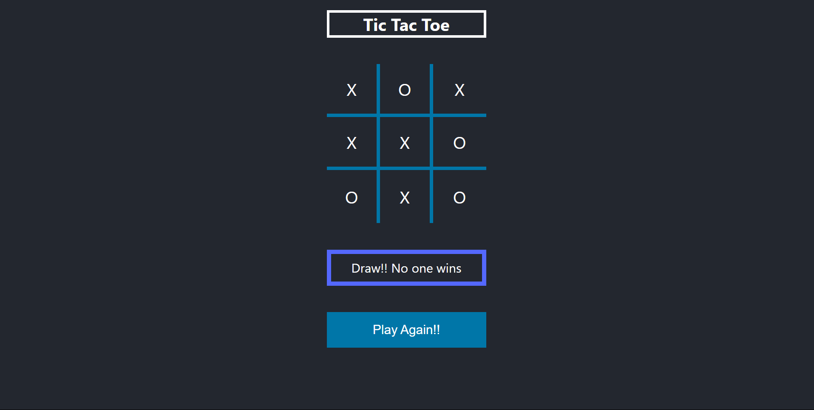

<h1> TIC TAC TOE (REACT) </h1>

<pre style="font-size: 1rem">
    This repository is on a simple multiplayer game 'Tic-Tac-Toe'. I built this project using 'React'. The methodologies used here is hooks like 'useState' and 'useEffect', and 'Js sounds' is also used for clicking tiles of board and Game over sounds.
    This is a small project so i used 'prop drilling' but 'useContext' hook is recommended.
</pre>
-------------------------------------------------------------------------------------------
App Look:
--------

